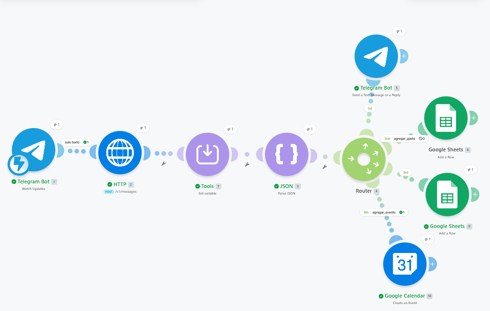

# 🤖 Pistachito Bot — Documentación del Proyecto

## Descripción

Bot de Telegram familiar para Jero y Flor. Permite registrar gastos, gestionar listas de compras y agendar eventos mediante lenguaje natural, usando Claude como motor de inteligencia artificial.

---

## Tecnologías

| Herramienta | Uso |
|---|---|
| **Telegram Bot** (@Pistachito) | Interfaz de usuario — canal de entrada y salida |
| **Make.com** | Orquestador del pipeline — conecta todos los servicios |
| **Claude API** (claude-sonnet-4-5) | Procesamiento de lenguaje natural e intención |
| **Google Sheets** | Base de datos de gastos y lista de compras |
| **Google Calendar** | Gestión de eventos y agenda |

---

## Pipeline actual

```
Telegram (mensaje)
    ↓
[Filtro: solo mensajes con texto]
    ↓
HTTP → Claude API
    ↓
Tools → Set Variable (limpieza JSON)
    ↓
JSON Parse (extrae accion + respuesta + datos)
    ↓
Router
    ├── 1st → Telegram (chat / fallback)
    ├── 2nd [accion = agregar_gasto] → Google Sheets (gastos)
    ├── 3rd [accion = agregar_compra] → Google Sheets (compras)
    └── 4th [accion = agregar_evento] → Google Calendar
```

---

## Estructura del JSON que devuelve Claude

```json
{
  "accion": "agregar_gasto | agregar_compra | agregar_evento | ver_gastos | ver_compras | ver_agenda | chat",
  "respuesta": "Mensaje corto en español informal confirmando la acción",
  "datos": {
    // campos según la acción
  }
}
```

---

## Recursos

| Recurso | ID / Link |
|---|---|
| Google Sheet Gastos | `YOUR_SHEET_ID` |
| Google Sheet Compras | `YOUR_SHEET_ID` |
| Google Drive carpeta | `YOUR_DRIVE` |
| Make.com scenario | [make.com](https://make.com) |
| Anthropic Console | [console.anthropic.com](https://console.anthropic.com) |

---

## Columnas Google Sheets

### Gastos
`Fecha | Tipo de gasto | Categoría | Descripción | Valor | Moneda (ARS) | Moneda (USD) | Autor`

### Lista de compras
`Fecha | Lista de items | Comprado | Autor`

---

## ✅ Funcionalidades implementadas

- [x] Chat con el bot en lenguaje natural
- [x] Registrar gastos → Google Sheets
- [x] Agregar items a lista de compras → Google Sheets
- [x] Crear eventos en Google Calendar (con invitación a Flor)
- [x] Detección automática de moneda (USD si están en EEUU, ARS si están en Argentina)
- [x] Detección automática del autor (Jero o Flor)
- [x] Funciona en grupo de Telegram (mencionando @Pistachito)
- [x] Filtro para ignorar mensajes sin texto (fotos, stickers, etc.)

---

## 🔲 Proyectado / Próximas funcionalidades

### Rutas de lectura
- [ ] `ver_gastos` → leer Google Sheets y responder con resumen diario/mensual
- [ ] `ver_compras` → leer lista de compras pendientes
- [ ] `ver_agenda` → leer Google Calendar y mostrar próximos eventos

### Mejoras de UX
- [ ] Memoria conversacional (guardar historial en Sheets y mandarlo a Claude)
- [ ] Soporte para fotos (guardar en Google Drive)
- [ ] Categorización automática de gastos con IA
- [ ] Resumen semanal automático enviado por Telegram

### Dashboard

- [ ] Dashboard interactivo para visualizar gastos y compras (gráficos por categoría, período, moneda)

### Reportes
- [ ] Reporte mensual de gastos por categoría
- [ ] Comparativa ARS vs USD
- [ ] Alerta cuando se supera un presupuesto

---

## Notas técnicas

- El bot usa **prefill** en la API de Claude (`"role": "assistant", "content": "{"`) para garantizar respuesta en JSON puro sin markdown
- El módulo **Tools → Set variable** limpia cualquier backtick residual antes del JSON Parse
- El autor se detecta automáticamente con `{{1.message.from.first_name}}`
- Saldo API Claude restante: ~$9.61 USD (Mayo 2026)
